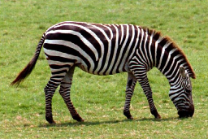
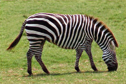
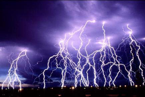
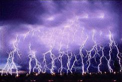

# SinGAN implementation with NNabla
Reproduction of "SinGAN: Learning a Generative Model from a Single Natural Image" with NNabla.

https://arxiv.org/abs/1905.01164


## install
```
$ pip install -r requirements.txt
```
If you use GPU, see [here](https://nnabla.readthedocs.io/en/latest/python/pip_installation_cuda.html).

## train
```
$ python main.py --image-path <path-to-image> --gpu
```

## sample image
### zebra
| real | generated |
|:-:|:-:|
| </img> | </img> |

### lightning
| real | generated |
|:-:|:-:|
| </img> | </img> |
